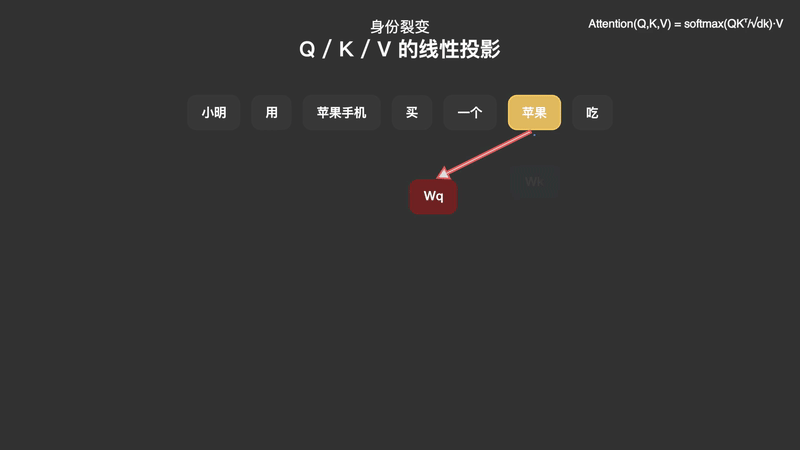

# 🎬 Agent Workflow: Manim Explainer

> A fully automated AI workflow for Large Language Models (LLMs) to generate high-quality, audio-driven Manim explanatory videos from scratch.

 *(可在此处放置一个生成好的视频转GIF或静态封面)*

## 🌟 核心特性 (Features)

这是专为 AI 编码助手（如 ClaudeCode, OpenVite, 等）设计的元工作流文档。将其喂给 Agent，它将完全自动化运行以下全套流程：

- **🎙️ 声画驱动范式 (Audio-Driven Architecture)**: 彻底抛弃传统的硬编码 `self.wait(N)`。先生成 TTS 配音，再用 `ffprobe` 测量真实时长驱动主时间轴；结合 `Whisper` 的词级时间戳，实现精准渲染动画。
- **🧠 自动视听脚本编排**: 从主题自动规划六段式大纲（含🪝钩子句、⚙️机制句、🔗过渡句），保证科普视频的高信息密度。
- **🧩 强力组件复用**: 规范化约束 Agent 复用精美的预制资产（如 `WordToken`, 悬挂公式 `FormulaHUD`, 多皮肤吉祥物等）。
- **⚡ 闭环自验证**: 包含渲染报错自检与音轨合成注入（Level 2），在后台一气呵成。

---

## 🚀 极速上手 (Quick Start)

### 1. 环境准备与依赖安装

请确保你的本地系统已安装 `ffmpeg`和 LaTeX（如 Mac 上的 `mactex`）。
然后克隆此仓库并安装 Python 依赖：

```bash
git clone https://github.com/YourUsername/agent-workflow-manim-explainer.git
cd agent-workflow-manim-explainer

# 推荐使用虚拟环境
python3 -m venv venv
source venv/bin/activate

# 安装必须的库
pip install -r requirements.txt
```

### 2. 初始化核心依赖组件

工作流依赖基础的类资产（如吉祥物，词牌等）。你可以在 `examples/` 目录下找到 `attention_v4.py` 的基础组件定义。请确保你的工作区内包含这些定义。

### 3. 如何使唤你的 AI Agent

开启你的 AI 助手（带命令行或文件执行权限的系统级 Agent），直接向它发送以下第一句话（Prompt）：

```text
请读取 workflows/manim-explainer.md。

/manim-explainer
主题：如何通俗理解 Transformer 的 Self-Attention 机制
受众：初中生
时长：2分钟
```

接下来，Agent 会自动帮你：出剧本 -> 写 Manim 动画代码 -> 生成 TTS 配音 -> 生成 Whisper 词级字典 -> 渲染视频 -> 混音输出。

---

## 🛠 给普通开发者的阅读指北（面向未来博客集成）

如果你想将此类工作流展示在自己的博客上：
1. **模块化设计**: `.agent/workflows/` 下的 `manim-explainer.md` 包含标准 YAML Frontmatter，原生支持 VitePress / Hugo 等主流静态或者部署平台解析。
2. **完全可插拔**: Puedes easily adapt the prompt sections to invoke entirely different animation tools while keeping the same meta-workflow mechanism.

## 📄 许可 (License)
MIT
